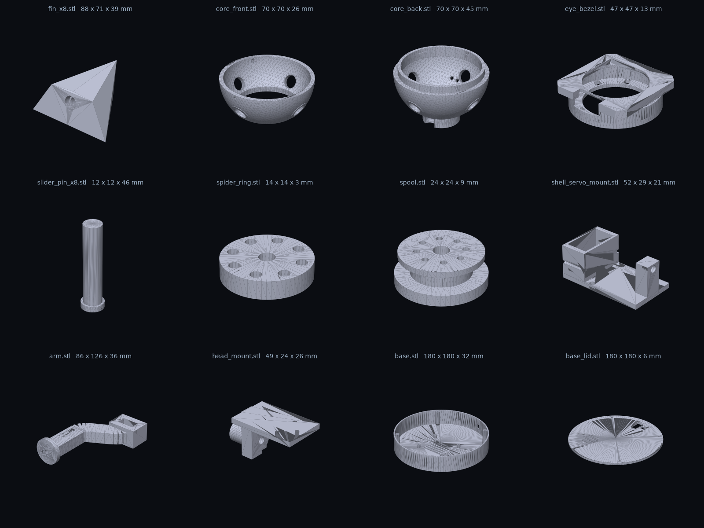
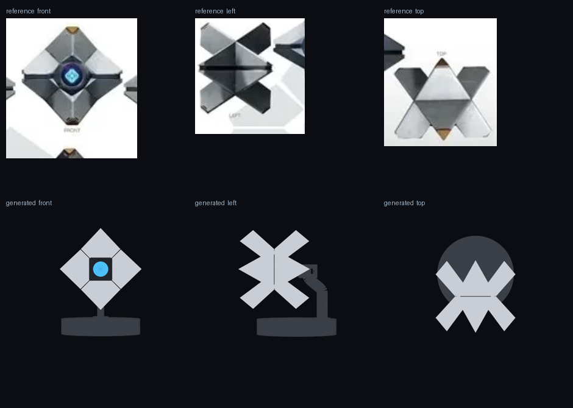

# 02 · Printing

All parts are generated by `hardware/generate_stl.py` and live in `hardware/stl/`. Re-run the script to change any dimension (every number is a parameter at the top of the file).

## Parts list

| File | Print | Material | Orientation | Supports | Infill | Time (0.2 mm) |
|------|-------|----------|-------------|----------|--------|----------------|
| `fin_x8.stl` | **×8** | silver | as exported: largest flat face down | build-plate-only supports | 15 % | ~2 h each |
| `core_front.stl` | 1 | black | as exported: cut face down, eye bore up | no | 20 % | ~2.5 h |
| `core_back.stl` | 1 | black | as exported: cut face down, lip up | small supports under the neck pad and pegs help | 20 % | ~3 h |
| `eye_bezel.stl` | 1 | white / translucent | as exported: lens lip down | no | 100 % | 25 min |
| `slider_pin_x8.stl` | **×8** | any | as exported: cap down, vertical | no | 100 %, 4 walls | 20 min each |
| `spider_ring.stl` | 1 | any | as exported | no | 100 % | 5 min |
| `spool.stl` | 1 | any | as exported | no | 100 % | 15 min |
| `shell_servo_mount.stl` | 1 | black | as exported: foot down | no | 40 % | 45 min |
| `arm.stl` | 1 | black | as exported: on its side | yes, for the servo pocket and the bend | 40 %, 4 walls | ~3.5 h |
| `head_mount.stl` | 1 | black | as exported | yes | 60 %, 4 walls | 40 min |
| `base.stl` | 1 | black | as exported: floor down | no | 15 % | ~6 h |
| `base_lid.stl` | 1 | black | as exported: top face down | no | 20 % | ~2 h |

Total print time is about **32 h** on a 0.4 mm nozzle. The shell pieces are 88 × 71 × 39 mm each and look great in a silk silver.

## Settings that matter

- **Layer height** 0.2 mm (0.16 for the fins if you want crisp tips).
- **Walls** 3 (4 on the arm and head_mount, they carry the head).
- **Tolerances** are built in: pegs are 10 mm Ø into 10.8 mm sockets; the bezel is 46.8 mm into a 47.2 mm bore; the core lip is 0.6 mm smaller than the front cavity. If your printer runs tight, sand the pegs; if loose, a drop of CA glue fixes everything.
- **Shell pieces**: each is a convex solid with a 40 mm blunt tip edge, two wings and three inner corners. It rests on its largest face; two of the other faces lean past 45°, so enable supports touching the build plate only. The socket is a 10 mm hole for the slider pin (glue fit) behind a 13 mm × 6 mm counterbore that swallows the compressed spring, so the closed shell keeps the reference's tight seams.
- **Slider pins**: 9.6 mm pins that run in the core's 10.3 mm guide tubes. Print them slow and clean, then sand lightly with 400 grit until they slide freely with no wobble. A dab of silicone grease helps.
- **Core halves**: the guide tubes are printed in; poke a 10 mm drill or a pin through each bore to clear any sag. The 4.4 mm hole in the neck socket is for the Bowden wire.
- **Head mount**: printed with a 4.3 mm bore straight through for the PTFE tube. Run a 4 mm drill through it after printing.
- **Core halves**: the sphere is a 3 mm shell. Print with a brim; the flat cut face gives plenty of adhesion.
- **Base**: nothing fancy. The vent slots and Pi standoffs are on the floor.

## Finishing (optional, but it's what makes it look like *the* Ghost)

1. Sand the fins' flat front faces to 400 grit. Everything else can stay as printed.
2. Two light coats of filler primer, sand at 400.
3. Fins: a bright silver or "aluminium" metallic. The reference sheet shows warm brass/gold **tips** on the fins: mask the outer 8 mm and hit them with a gold or copper metallic.
4. Core, arm, base: matte black or gunmetal.
5. Bezel: leave it white. The LED ring lights it from behind.
6. A satin clear coat over everything.

## Scaling

`python3 hardware/generate_stl.py --scale 0.95` shrinks the shell and core (the stand and base stay the same). Below about 0.95 the 36.5 mm display PCB no longer fits inside the sphere, so for a smaller Ghost swap in a 0.96" or 1.14" display and shrink `eye_bore_r` / `bezel_*` too.

## How the shell geometry was derived

Each of the 8 pieces is the convex hull of six kinds of points read off the reference sheet, defined in `piece_points()`:

- a **blunt tip edge** (40 mm) so the tip is a point from the front but a flat end from the side, like the arms of the X on the sheet;
- two **wings** on the diamond's edge midpoints, on the mid-plane, where four pieces meet; they give the solid diamond from the front and the central diamond + notch pattern from the top and side;
- two **inner corners on the diagonals** at the eye ring, shared with the neighbouring pieces so the front shows thin X seams from the eye to the edge midpoints;
- an **inner-front corner** where the ridge (the crease down the middle of each piece) ends beside the eye bezel, and an **inner-back corner** on the seam plane.

The top-front piece is built once; the other seven are 90° rotations about the eye axis and a front/back mirror. Every dimension is a parameter at the top of the generator.
