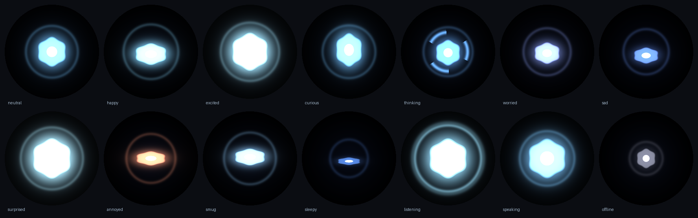

# 06 · Voice and personality

## Voice

The game's Ghost is voiced by an actor, and cloning a real person's voice without permission isn't something this project does. What we do instead gets close to the character's *feel*: a warm, slightly boyish male voice with a clean, faintly synthetic edge.

**Default: Piper (offline)** with the `en_US-ryan-medium` voice, then the Ghost filter chain in `ghost/tts.py`:

1. a small pitch lift (`GHOST_VOICE_PITCH=1.06`, try 1.03–1.10)
2. high-pass at 140 Hz (small body, no chest resonance)
3. presence boost around 2.8 kHz and a little sheen at 5 kHz
4. a 9 ms metallic slap delay
5. a soft limiter

Turn the filter off with `GHOST_VOICE_FX=false` to hear the raw voice. Other Piper voices worth trying (download from https://huggingface.co/rhasspy/piper-voices, set `PIPER_MODEL`): `en_US-joe-medium` (darker), `en_US-lessac-medium` (neutral), `en_GB-alan-medium` (British, oddly Ghost-ish).

`PIPER_LENGTH=0.95` makes him talk a touch faster; 1.05 slower.

**Optional: ElevenLabs (cloud).** Better prosody, ~300 ms extra latency, costs money. Design a voice in their Voice Design tool that sounds like a chipper, earnest robot companion, then:

```
GHOST_TTS=elevenlabs
ELEVENLABS_API_KEY=...
ELEVENLABS_VOICE_ID=...
```

The Ghost filter still runs on top unless you turn it off.

## Personality

All of it is in `software/ghost/personality.py`. The system prompt tells Claude who the Ghost is, how to speak for TTS (short, no lists, numbers in words), and how to use the **emotion tags**.

Every reply starts with a tag like `[curious]` and may change mid-reply. The tags are stripped before speech and drive:

| tag | eye | LED ring | head | shell |
|---|---|---|---|---|
| neutral | steady blue, slow breathing, blinks | soft glow | idle drift | closed |
| happy | squashed "smile" | brighter | bounce | 40 % |
| excited | big and bright | pulsing | wiggle | open |
| curious | tall, tilted | steady | head tilt | half |
| thinking | spinner arcs | chasing light | look up | open (scanning) |
| worried | small, purple-blue | dim | shrink back | closed |
| sad | dim, drooping | dark blue | droop | closed |
| surprised | wide, white | flash | recoil | open |
| annoyed | narrow, orange | orange | head shake | closed |
| smug | half-lidded | steady | tilt | 30 % |
| sleepy | thin line | very dim | droop | closed |
| listening | bright, rippling | pulsing | lean in | 60 % |

Waking to "Hey Ghost" also fires the **scan flare**: the shell snaps fully open for half a second and settles back.



Add a mood: put it in `EMOTIONS`, give it a row in `MOODS` (`eye.py`), `COLORS` (`lights.py`) and the table in `Body.mood()` (`motion.py`).

## Model

`GHOST_MODEL=claude-opus-5` at `GHOST_EFFORT=low` is the default: it keeps replies snappy while staying in character. Raise effort to `medium` if you want him to think harder about real questions. Refusal fallback (`GHOST_FALLBACKS=true`) is on by default, which means that if the model declines something for policy reasons the API retries on a fallback model inside the same call; the Ghost still says its canned refusal line if the whole chain declines.

The conversation is kept for 12 turns and forgotten after 20 minutes of silence, or when you say "forget everything".

## Tools (what he can *do*)

`ghost/tools.py`:

| tool | what |
|---|---|
| `get_time` | date/time/day |
| `set_timer` / `cancel_timer` / `list_timers` | countdown timers; he announces them when they fire |
| `get_weather` | Open-Meteo, no key needed |
| `set_volume` | 0–100 |
| `home_assistant` | any HA service call, only offered when `HA_URL` + `HA_TOKEN` are set |

Adding one: append a schema to `definitions()`, a branch in `run()`, done. The validator reads the schema. Keep inputs flat (strings, integers, one object) because the inputs stream in eagerly and the Ghost validates them itself.

## Things he says on his own

- Wake with no speech: a short ack ("Guardian?") and a 6-second follow-up window.
- Timer firing: chime + one of the `TIMER_LINES`.
- API down: one of the `OFFLINE_LINES` ("I've lost my link to the Tower").
